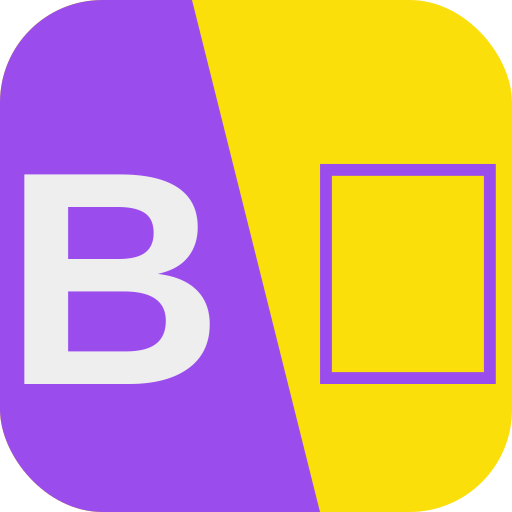

    
<h2>Barabari Anuvaadak</h2>

A translator wrapper for TBP internal usage, will probably extend with APIs to automatically generate resources like forms

> Project currently is both in progress and experimental. Please assume basically everything can change.

## Structure
- Server: Python Based (with API)
- Model: Idk yet frankly, We will use the following as models, both based on OpenAI system so that at least now we're not dependent on some mega corporation at a security risk.
    - [OpenAI/Whisper](https://github.com/openai/whisper) - Transcription & Translation
    - [OpenAI/GPT3](https://openai.com/api/) - Text Translation
- Frontend: SvelteKit (JS)
- Docs: Docsify Vue Docs

## Optimisations
Whisper - https://github.com/openai/whisper/discussions/208 (CPP)

## Features
- Directly Transcribe and Translate Youtube Video from URL
- Translate english to [any more languages 0 config]
    - Bengali
    - English
    - Hindi