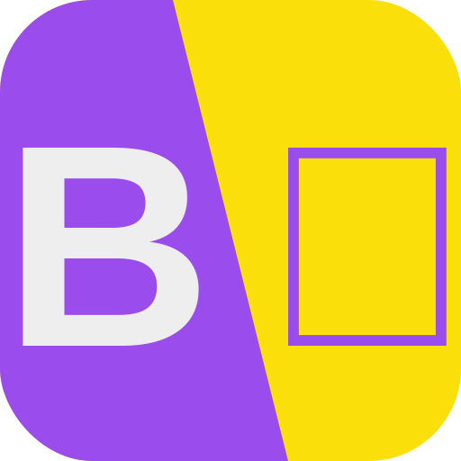

<h2>Barabari Anuvaadak</h2>

A translator wrapper for TBP internal usage, will probably extend with APIs to automatically generate resources like forms

> Project currently is both in progress and experimental. Please assume basically everything can change.

## Resources
We will use the following as models
- OpenAI/Whisper - Language transcription and transaltion
- [EXPT:] [OpenAI/GPT3](https://openai.com/api/) - Translation
- [EXPT:] facebook/NLLB - Translation

## Structure
- Server: Python Based
- Model: Idk yet frankly
- Frontend: SvelteKit (JS)
- APIs: If at all we need any
- Docs: Docsify Vue Docs

## Optimisations
Whisper - https://github.com/openai/whisper/discussions/208 (CPP)
