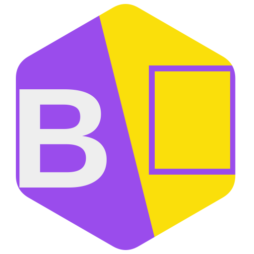
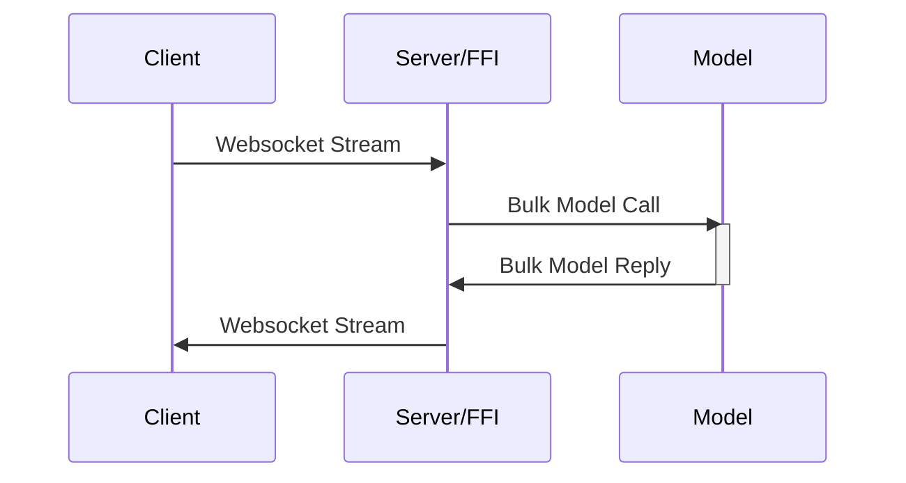

# Anuvaadak
<a
    href="//anuvaadak.nukes.in" class="try b0 d-ib rx10"
    style="font-size: 18px !important;line-height: 0.5em;padding: 12px 16px;background: var(--theme-color);color: #fff !important;"
    >
    
    Try Now
</a>

A translator wrapper for TBP internal usage, will probably extend with APIs to automatically generate resources like forms

    

## Features
- Directly Transcribe and Translate Youtube Video from URL
- Translate english to [any more languages 0 config]
    - Bengali
    - English
    - Hindi

## Structure

